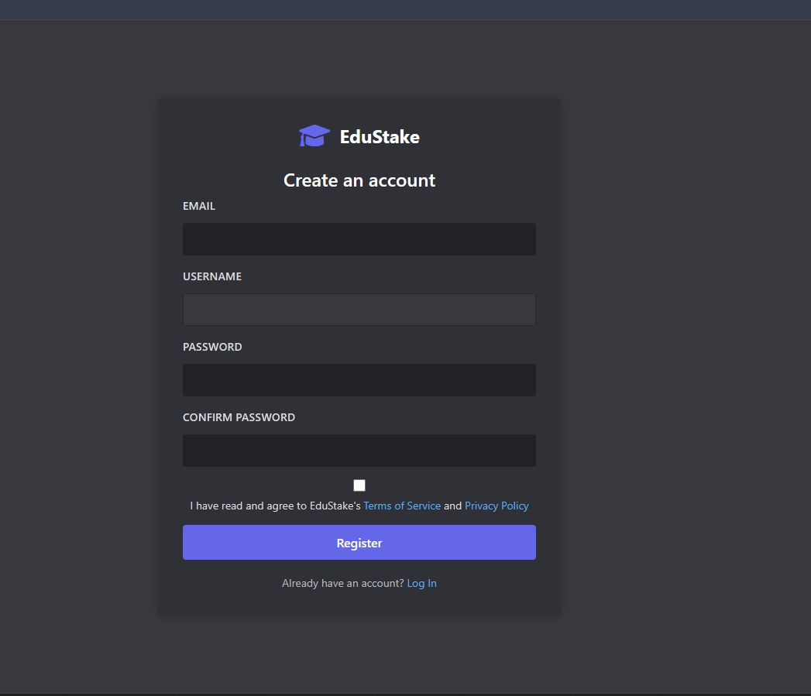
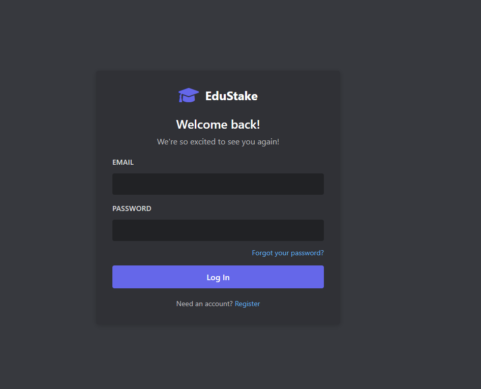
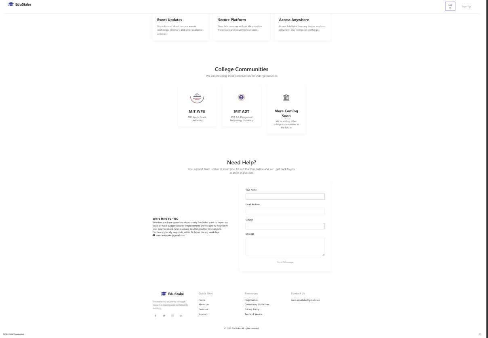
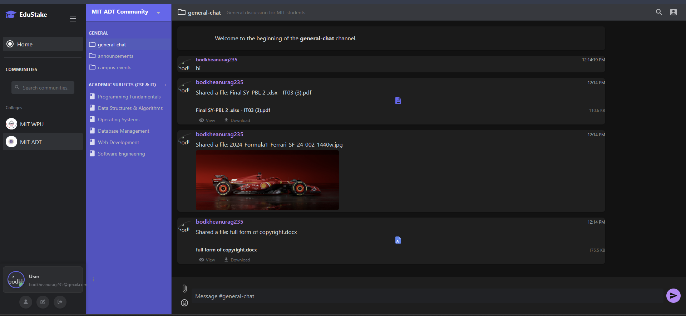
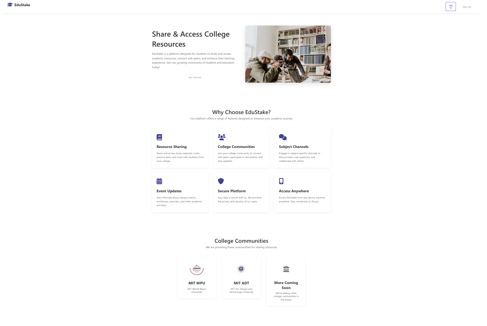

# EduStake - College Resource Sharing Platform

A modern, responsive platform for college students to share educational resources, collaborate in study groups, and communicate with peers. Built with HTML, CSS, JavaScript, and Firebase integration for real-time data management and authentication.

## 🌟 Features

- **User Authentication**
  - Secure login and registration system
  - Firebase authentication integration
  - User profile management
  - Session-based user management

- **Resource Sharing**
  - Upload and share study materials
  - Support for various file formats (PDF, Word, PowerPoint, Images)
  - File preview functionality
  - Download resources

- **Community Interaction**
  - College communities
  - Real-time chat functionality
  - Voice channels for study rooms
  - Event updates and notifications

- **Responsive Design**
  - Mobile-first approach
  - Cross-browser compatibility
  - Modern UI/UX with smooth animations
  - Dark mode support

## 🚀 Technologies Used

- **Frontend**
  - HTML5
  - CSS3 (with CSS variables)
  - Vanilla JavaScript
  - Font Awesome Icons

- **Backend & Storage**
  - Firebase Authentication
  - Firebase Realtime Database
  - Firebase Storage
  - EmailJS for contact form

- **Data Management**
  - Hybrid storage system (localStorage + server)
  - Real-time data synchronization
  - Offline capability

## 📥 Installation

1. Clone the repository:
```bash
git clone https://github.com/AnuragBodkhe/EduStake.git
```

2. Open the project in your preferred code editor

3. Set up Firebase:
   - Create a Firebase project at [Firebase Console](https://console.firebase.google.com/)
   - Enable Authentication, Realtime Database, and Storage
   - Update the Firebase configuration in `firebase-config.js`

4. Configure EmailJS (for contact form):
   - Create an account at [EmailJS](https://www.emailjs.com/)
   - Set up an email service and template
   - Update the EmailJS configuration in the contact form section

5. Open `index.html` in a web browser or use a local development server

## 🔧 Configuration

1. Firebase Security Rules:
   - Update database rules in `firebase-database-rules.json`
   - Update storage rules in `firebase-storage-rules.json`
   - See `FIREBASE-SECURITY-RULES.md` for detailed instructions

2. Email Configuration:
   - Follow the setup guide in `emailjs-setup.md`
   - Troubleshooting tips available in `emailjs-troubleshooting.md`

## 📱 Features Overview

### Dashboard
- College communities sidebar
- Resource sharing
- Real-time chat
- Voice channels for study rooms

### User Profile
- Personal information management
- Profile picture customization
- Resource management
- Activity tracking

### Resource Library
- Upload and share study materials
- Categorized resources
- Search functionality
- File preview and download

### Community Interaction
- Join college communities
- Real-time messaging
- Event updates
- Collaboration tools

## 💾 Storage System

EduStake uses a hybrid storage system that combines:

1. **localStorage** - For immediate access and offline capability
2. **Firebase Storage** - For file storage and sharing
3. **Firebase Realtime Database** - For user data and chat messages
4. **Server-side storage** - For persistent data across devices

The system automatically synchronizes data between these storage methods to provide a seamless user experience.

## 📝 Developer

**Anurag Bodkhe**
- LinkedIn: [Anurag Bodkhe](https://www.linkedin.com/in/anurag-bodkhe-087758292)
- Institution: MIT Art, Design and Technology University, Pune

## 📄 License

This project is licensed under the MIT License - see the [LICENSE](LICENSE) file for details.

## 🏫 Academic Project

This project was developed as part of the academic curriculum at MIT Art, Design and Technology University, demonstrating practical implementation of web development concepts and educational resource sharing solutions.

## 📞 Contact

For any queries regarding this project, please contact:
- **Phone:** 9022977272
- **Location:** MIT Art, Design and Technology University
- **Address:** Rajbaugh, Loni Kalbhor, Solapur Highway
- **City:** Pune - 412201, Maharashtra, India

## 📸 Screenshots

### Registration Page
<<<<<<< HEAD


### Login Page


### Dashboard - Resource Sharing


### Landing Page - Features


### College Communities


### Contact Support


### Resource Library

=======
<<<<<<< HEAD


### Login Page


### Dashboard - Resource Sharing


### Landing Page - Features


### College Communities


### Contact Support


### Resource Library

=======
>>>>>>> 7d1d930e9b3c1c0633baa77559dc60d9c19161fb
